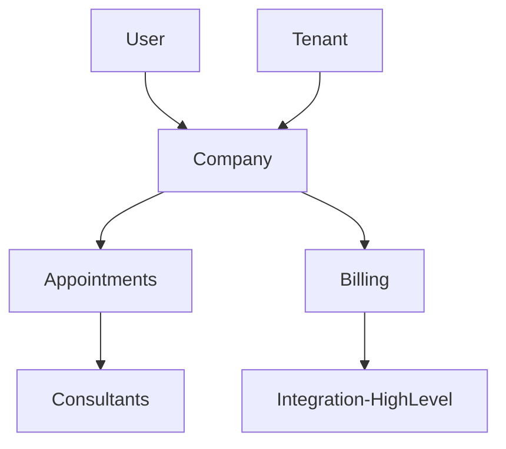

# Module Architecture Documentation

## Overview

This document provides comprehensive documentation for the modular architecture system used in the Laravel application. The system follows a modular monolith pattern where each business domain is organized as a separate, self-contained module.

## Architecture Principles

### Modular Monolith Pattern
- **Single Codebase**: All modules exist within the same repository
- **Domain Separation**: Each module represents a distinct business domain
- **Loose Coupling**: Modules communicate through well-defined interfaces
- **High Cohesion**: Related functionality is grouped within modules
- **Shared Infrastructure**: Common services and utilities are shared across modules

### Module Structure
Each module follows a standardized directory structure:

```
app-modules/{module-name}/
├── composer.json                    # Module package definition
├── src/
│   ├── Providers/                   # Service providers
│   │   └── {ModuleName}ServiceProvider.php
│   ├── Models/                      # Eloquent models
│   ├── Filament/                    # Admin panel resources
│   │   ├── Admin/Resources/         # Admin panel resources
│   │   ├── App/Resources/           # User panel resources
│   │   ├── Company/Resources/       # Company panel resources
│   │   ├── Consultant/Resources/    # Consultant panel resources
│   │   └── Guest/Resources/         # Guest panel resources
│   ├── Enums/                       # Enum classes
│   ├── Actions/                     # Business logic actions
│   ├── DTO/                         # Data Transfer Objects
│   ├── Repositories/                # Data access layer
│   │   ├── Contracts/               # Repository interfaces
│   │   └── Eloquent/                # Eloquent implementations
│   ├── Services/                    # Domain services
│   ├── Events/                      # Domain events
│   ├── Listeners/                   # Event listeners
│   ├── Jobs/                        # Background jobs
│   ├── Policies/                    # Authorization policies
│   ├── Rules/                       # Validation rules
│   └── Exceptions/                  # Module-specific exceptions
├── database/
│   ├── migrations/                  # Database migrations
│   ├── factories/                   # Model factories
│   └── seeders/                     # Database seeders
├── tests/                           # Module-specific tests
│   ├── Unit/                        # Unit tests
│   ├── Feature/                     # Feature tests
│   └── Browser/                     # Browser tests
├── lang/                            # Translations
│   ├── en/                          # English translations
│   └── pt_BR/                       # Portuguese translations
├── resources/
│   └── views/                       # Blade templates
└── routes/                          # Module routes (if needed)
    ├── web.php
    └── api.php
```

## Core Interfaces and Contracts

### Repository Pattern

#### Base Repository Interface
```php
<?php

namespace App\Repositories\Contracts;

use Illuminate\Database\Eloquent\Collection;
use Illuminate\Database\Eloquent\Model;
use Illuminate\Pagination\LengthAwarePaginator;

/**
 * Base repository interface defining standard CRUD operations.
 * 
 * This interface establishes a contract for all repository implementations,
 * ensuring consistent data access patterns across modules.
 * 
 * @template TModel of Model
 */
interface RepositoryInterface
{
    /**
     * Get all records with optional relationships.
     *
     * @param array<string> $with Relationships to eager load
     * @return Collection<int, TModel>
     */
    public function all(array $with = []): Collection;

    /**
     * Find a record by ID with optional relationships.
     *
     * @param int $id Record ID
     * @param array<string> $with Relationships to eager load
     * @return TModel|null
     */
    public function find(int $id, array $with = []): ?Model;

    /**
     * Find a record by ID or fail.
     *
     * @param int $id Record ID
     * @param array<string> $with Relationships to eager load
     * @return TModel
     * @throws \Illuminate\Database\Eloquent\ModelNotFoundException
     */
    public function findOrFail(int $id, array $with = []): Model;

    /**
     * Create a new record.
     *
     * @param array<string, mixed> $data Record data
     * @return TModel
     */
    public function create(array $data): Model;

    /**
     * Update a record by ID.
     *
     * @param int $id Record ID
     * @param array<string, mixed> $data Updated data
     * @return TModel
     */
    public function update(int $id, array $data): Model;

    /**
     * Delete a record by ID.
     *
     * @param int $id Record ID
     * @return bool
     */
    public function delete(int $id): bool;

    /**
     * Get paginated records with optional relationships.
     *
     * @param int $perPage Records per page
     * @param array<string> $with Relationships to eager load
     * @return LengthAwarePaginator<TModel>
     */
    public function paginate(int $perPage = 15, array $with = []): LengthAwarePaginator;

    /**
     * Get records by specific criteria.
     *
     * @param string $column Column name
     * @param mixed $value Column value
     * @param array<string> $with Relationships to eager load
     * @return Collection<int, TModel>
     */
    public function where(string $column, mixed $value, array $with = []): Collection;

    /**
     * Get the first record matching criteria.
     *
     * @param string $column Column name
     * @param mixed $value Column value
     * @param array<string> $with Relationships to eager load
     * @return TModel|null
     */
    public function firstWhere(string $column, mixed $value, array $with = []): ?Model;
}
```

#### Module-Specific Repository Interfaces

**Example: Appointment Repository Interface**
```php
<?php

namespace TresPontosTech\Appointments\Repositories\Contracts;

use App\Repositories\Contracts\RepositoryInterface;
use Illuminate\Database\Eloquent\Collection;
use TresPontosTech\Appointments\Models\Appointment;

/**
 * Appointment repository interface extending base repository functionality.
 * 
 * This interface defines appointment-specific data access methods
 * beyond the standard CRUD operations.
 */
interface AppointmentRepositoryInterface extends RepositoryInterface
{
    /**
     * Get appointments for a specific user.
     *
     * @param int $userId User ID
     * @param array<string> $with Relationships to eager load
     * @return Collection<int, Appointment>
     */
    public function getByUser(int $userId, array $with = []): Collection;

    /**
     * Get appointments for a specific company.
     *
     * @param int $companyId Company ID
     * @param array<string> $with Relationships to eager load
     * @return Collection<int, Appointment>
     */
    public function getByCompany(int $companyId, array $with = []): Collection;

    /**
     * Get appointments by status.
     *
     * @param string $status Appointment status
     * @param array<string> $with Relationships to eager load
     * @return Collection<int, Appointment>
     */
    public function getByStatus(string $status, array $with = []): Collection;

    /**
     * Get appointments within a date range.
     *
     * @param \Carbon\Carbon $startDate Start date
     * @param \Carbon\Carbon $endDate End date
     * @param array<string> $with Relationships to eager load
     * @return Collection<int, Appointment>
     */
    public function getByDateRange(\Carbon\Carbon $startDate, \Carbon\Carbon $endDate, array $with = []): Collection;

    /**
     * Get appointment statistics for a company.
     *
     * @param int $companyId Company ID
     * @return array<string, mixed> Statistics array
     */
    public function getStatsForCompany(int $companyId): array;

    /**
     * Get upcoming appointments for a user.
     *
     * @param int $userId User ID
     * @param int $limit Maximum number of appointments
     * @return Collection<int, Appointment>
     */
    public function getUpcomingForUser(int $userId, int $limit = 10): Collection;

    /**
     * Check if user has any ongoing appointments.
     *
     * @param int $userId User ID
     * @return bool
     */
    public function hasOngoingAppointments(int $userId): bool;
}
```

### Service Layer Interfaces

#### Domain Service Interface
```php
<?php

namespace TresPontosTech\Appointments\Services\Contracts;

use TresPontosTech\Appointments\DTO\AppointmentBookingDTO;
use TresPontosTech\Appointments\DTO\AppointmentResult;
use TresPontosTech\Appointments\Models\Appointment;

/**
 * Appointment service interface defining business logic operations.
 * 
 * This interface encapsulates complex business rules and workflows
 * related to appointment management.
 */
interface AppointmentServiceInterface
{
    /**
     * Book a new appointment.
     *
     * @param AppointmentBookingDTO $dto Booking data
     * @return AppointmentResult Booking result with success/failure status
     */
    public function bookAppointment(AppointmentBookingDTO $dto): AppointmentResult;

    /**
     * Cancel an existing appointment.
     *
     * @param int $appointmentId Appointment ID
     * @param int $userId User requesting cancellation
     * @param string|null $reason Cancellation reason
     * @return AppointmentResult Cancellation result
     */
    public function cancelAppointment(int $appointmentId, int $userId, ?string $reason = null): AppointmentResult;

    /**
     * Reschedule an appointment.
     *
     * @param int $appointmentId Appointment ID
     * @param \Carbon\Carbon $newDateTime New appointment date/time
     * @param int $userId User requesting reschedule
     * @return AppointmentResult Reschedule result
     */
    public function rescheduleAppointment(int $appointmentId, \Carbon\Carbon $newDateTime, int $userId): AppointmentResult;

    /**
     * Check appointment availability.
     *
     * @param \Carbon\Carbon $dateTime Requested date/time
     * @param int $consultantId Consultant ID
     * @param int|null $excludeAppointmentId Appointment ID to exclude from check
     * @return bool True if slot is available
     */
    public function isSlotAvailable(\Carbon\Carbon $dateTime, int $consultantId, ?int $excludeAppointmentId = null): bool;

    /**
     * Get available time slots for a consultant on a specific date.
     *
     * @param int $consultantId Consultant ID
     * @param \Carbon\Carbon $date Date to check
     * @return array<string> Available time slots
     */
    public function getAvailableSlots(int $consultantId, \Carbon\Carbon $date): array;

    /**
     * Send appointment reminders.
     *
     * @param int $hoursBeforeAppointment Hours before appointment to send reminder
     * @return int Number of reminders sent
     */
    public function sendReminders(int $hoursBeforeAppointment = 24): int;
}
```

### Event System Interfaces

#### Domain Event Interface
```php
<?php

namespace TresPontosTech\Appointments\Events\Contracts;

/**
 * Base interface for appointment domain events.
 * 
 * All appointment-related events should implement this interface
 * to ensure consistent event handling across the module.
 */
interface AppointmentEventInterface
{
    /**
     * Get the appointment ID associated with this event.
     *
     * @return int Appointment ID
     */
    public function getAppointmentId(): int;

    /**
     * Get the user ID associated with this event.
     *
     * @return int User ID
     */
    public function getUserId(): int;

    /**
     * Get the event timestamp.
     *
     * @return \Carbon\Carbon Event timestamp
     */
    public function getTimestamp(): \Carbon\Carbon;

    /**
     * Get additional event data.
     *
     * @return array<string, mixed> Event data
     */
    public function getEventData(): array;
}
```

## Module Implementation Examples

### 1. Appointments Module

#### Service Provider
```php
<?php

namespace TresPontosTech\Appointments\Providers;

use Illuminate\Support\ServiceProvider;
use TresPontosTech\Appointments\Repositories\Contracts\AppointmentRepositoryInterface;
use TresPontosTech\Appointments\Repositories\Eloquent\AppointmentRepository;
use TresPontosTech\Appointments\Services\Contracts\AppointmentServiceInterface;
use TresPontosTech\Appointments\Services\AppointmentService;

/**
 * Appointments module service provider.
 * 
 * Registers all module services, repositories, and Filament resources.
 */
class AppointmentsServiceProvider extends ServiceProvider
{
    /**
     * Register module services.
     */
    public function register(): void
    {
        // Register repository bindings
        $this->app->bind(
            AppointmentRepositoryInterface::class,
            AppointmentRepository::class
        );

        // Register service bindings
        $this->app->bind(
            AppointmentServiceInterface::class,
            AppointmentService::class
        );
    }

    /**
     * Bootstrap module services.
     */
    public function boot(): void
    {
        // Load module translations
        $this->loadTranslationsFrom(__DIR__ . '/../../lang', 'appointments');

        // Load module migrations
        $this->loadMigrationsFrom(__DIR__ . '/../../database/migrations');

        // Register Filament resources
        $this->registerFilamentResources();

        // Register event listeners
        $this->registerEventListeners();
    }

    /**
     * Register Filament resources for all panels.
     */
    private function registerFilamentResources(): void
    {
        // Auto-discover resources in each panel directory
        $panels = ['Admin', 'App', 'Company', 'Consultant', 'Guest'];
        
        foreach ($panels as $panel) {
            $resourcePath = __DIR__ . "/../Filament/{$panel}/Resources";
            if (is_dir($resourcePath)) {
                // Resources are auto-discovered by Filament
            }
        }
    }

    /**
     * Register event listeners.
     */
    private function registerEventListeners(): void
    {
        // Event listeners are auto-discovered by Laravel
    }
}
```

#### Repository Implementation
```php
<?php

namespace TresPontosTech\Appointments\Repositories\Eloquent;

use App\Repositories\BaseRepository;
use Carbon\Carbon;
use Illuminate\Database\Eloquent\Collection;
use TresPontosTech\Appointments\Models\Appointment;
use TresPontosTech\Appointments\Repositories\Contracts\AppointmentRepositoryInterface;

/**
 * Eloquent implementation of the appointment repository.
 * 
 * Provides data access methods for appointment management
 * with optimized queries and caching support.
 */
class AppointmentRepository extends BaseRepository implements AppointmentRepositoryInterface
{
    /**
     * Create a new repository instance.
     */
    public function __construct(Appointment $model)
    {
        parent::__construct($model);
    }

    /**
     * Get appointments for a specific user.
     */
    public function getByUser(int $userId, array $with = []): Collection
    {
        return $this->model
            ->with($with)
            ->where('user_id', $userId)
            ->orderBy('scheduled_at', 'desc')
            ->get();
    }

    /**
     * Get appointments for a specific company.
     */
    public function getByCompany(int $companyId, array $with = []): Collection
    {
        return $this->model
            ->with($with)
            ->whereHas('user.company', function ($query) use ($companyId) {
                $query->where('id', $companyId);
            })
            ->orderBy('scheduled_at', 'desc')
            ->get();
    }

    /**
     * Get appointments by status.
     */
    public function getByStatus(string $status, array $with = []): Collection
    {
        return $this->model
            ->with($with)
            ->where('status', $status)
            ->orderBy('scheduled_at', 'desc')
            ->get();
    }

    /**
     * Get appointments within a date range.
     */
    public function getByDateRange(Carbon $startDate, Carbon $endDate, array $with = []): Collection
    {
        return $this->model
            ->with($with)
            ->whereBetween('scheduled_at', [$startDate, $endDate])
            ->orderBy('scheduled_at', 'asc')
            ->get();
    }

    /**
     * Get appointment statistics for a company.
     */
    public function getStatsForCompany(int $companyId): array
    {
        $cacheKey = "appointment_stats:company:{$companyId}";
        
        return cache()->remember($cacheKey, 1800, function () use ($companyId) {
            $baseQuery = $this->model
                ->whereHas('user.company', function ($query) use ($companyId) {
                    $query->where('id', $companyId);
                });

            return [
                'total' => $baseQuery->count(),
                'completed' => $baseQuery->where('status', 'completed')->count(),
                'pending' => $baseQuery->where('status', 'pending')->count(),
                'cancelled' => $baseQuery->where('status', 'cancelled')->count(),
                'this_month' => $baseQuery->whereMonth('scheduled_at', now()->month)->count(),
                'completion_rate' => $this->calculateCompletionRate($companyId),
            ];
        });
    }

    /**
     * Get upcoming appointments for a user.
     */
    public function getUpcomingForUser(int $userId, int $limit = 10): Collection
    {
        return $this->model
            ->with(['consultant', 'company'])
            ->where('user_id', $userId)
            ->where('scheduled_at', '>', now())
            ->whereIn('status', ['pending', 'confirmed'])
            ->orderBy('scheduled_at', 'asc')
            ->limit($limit)
            ->get();
    }

    /**
     * Check if user has any ongoing appointments.
     */
    public function hasOngoingAppointments(int $userId): bool
    {
        return $this->model
            ->where('user_id', $userId)
            ->whereIn('status', ['pending', 'confirmed', 'in_progress'])
            ->exists();
    }

    /**
     * Calculate completion rate for a company.
     */
    private function calculateCompletionRate(int $companyId): float
    {
        $total = $this->model
            ->whereHas('user.company', function ($query) use ($companyId) {
                $query->where('id', $companyId);
            })
            ->whereIn('status', ['completed', 'cancelled'])
            ->count();

        if ($total === 0) {
            return 0.0;
        }

        $completed = $this->model
            ->whereHas('user.company', function ($query) use ($companyId) {
                $query->where('id', $companyId);
            })
            ->where('status', 'completed')
            ->count();

        return round(($completed / $total) * 100, 2);
    }
}
```

#### Service Implementation
```php
<?php

namespace TresPontosTech\Appointments\Services;

use Carbon\Carbon;
use Illuminate\Support\Facades\DB;
use TresPontosTech\Appointments\DTO\AppointmentBookingDTO;
use TresPontosTech\Appointments\DTO\AppointmentResult;
use TresPontosTech\Appointments\Events\AppointmentBooked;
use TresPontosTech\Appointments\Events\AppointmentCancelled;
use TresPontosTech\Appointments\Events\AppointmentRescheduled;
use TresPontosTech\Appointments\Repositories\Contracts\AppointmentRepositoryInterface;
use TresPontosTech\Appointments\Services\Contracts\AppointmentServiceInterface;

/**
 * Appointment service implementation.
 * 
 * Handles complex business logic for appointment management
 * including booking, cancellation, and rescheduling workflows.
 */
class AppointmentService implements AppointmentServiceInterface
{
    public function __construct(
        private AppointmentRepositoryInterface $appointmentRepository
    ) {}

    /**
     * Book a new appointment.
     */
    public function bookAppointment(AppointmentBookingDTO $dto): AppointmentResult
    {
        // Validate appointment slot availability
        if (!$this->isSlotAvailable($dto->scheduledAt, $dto->consultantId)) {
            return AppointmentResult::failure('The selected time slot is not available.');
        }

        // Validate business rules
        if (!$this->validateBookingRules($dto)) {
            return AppointmentResult::failure('Booking validation failed.');
        }

        try {
            return DB::transaction(function () use ($dto) {
                // Create appointment
                $appointment = $this->appointmentRepository->create([
                    'user_id' => $dto->userId,
                    'consultant_id' => $dto->consultantId,
                    'company_id' => $dto->companyId,
                    'scheduled_at' => $dto->scheduledAt,
                    'duration_minutes' => $dto->durationMinutes,
                    'type' => $dto->type,
                    'notes' => $dto->notes,
                    'status' => 'pending',
                ]);

                // Dispatch appointment booked event
                event(new AppointmentBooked($appointment));

                return AppointmentResult::success($appointment);
            });
        } catch (\Exception $e) {
            return AppointmentResult::failure('Failed to book appointment: ' . $e->getMessage());
        }
    }

    /**
     * Cancel an existing appointment.
     */
    public function cancelAppointment(int $appointmentId, int $userId, ?string $reason = null): AppointmentResult
    {
        try {
            $appointment = $this->appointmentRepository->findOrFail($appointmentId);

            // Validate user can cancel this appointment
            if (!$this->canUserCancelAppointment($appointment, $userId)) {
                return AppointmentResult::failure('You are not authorized to cancel this appointment.');
            }

            // Validate cancellation timing
            if (!$this->canCancelAppointment($appointment)) {
                return AppointmentResult::failure('This appointment cannot be cancelled at this time.');
            }

            return DB::transaction(function () use ($appointment, $reason) {
                // Update appointment status
                $appointment = $this->appointmentRepository->update($appointment->id, [
                    'status' => 'cancelled',
                    'cancelled_at' => now(),
                    'cancellation_reason' => $reason,
                ]);

                // Dispatch appointment cancelled event
                event(new AppointmentCancelled($appointment, $reason));

                return AppointmentResult::success($appointment);
            });
        } catch (\Exception $e) {
            return AppointmentResult::failure('Failed to cancel appointment: ' . $e->getMessage());
        }
    }

    /**
     * Reschedule an appointment.
     */
    public function rescheduleAppointment(int $appointmentId, Carbon $newDateTime, int $userId): AppointmentResult
    {
        try {
            $appointment = $this->appointmentRepository->findOrFail($appointmentId);

            // Validate user can reschedule this appointment
            if (!$this->canUserRescheduleAppointment($appointment, $userId)) {
                return AppointmentResult::failure('You are not authorized to reschedule this appointment.');
            }

            // Validate new time slot availability
            if (!$this->isSlotAvailable($newDateTime, $appointment->consultant_id, $appointmentId)) {
                return AppointmentResult::failure('The selected time slot is not available.');
            }

            return DB::transaction(function () use ($appointment, $newDateTime) {
                $originalDateTime = $appointment->scheduled_at;

                // Update appointment
                $appointment = $this->appointmentRepository->update($appointment->id, [
                    'scheduled_at' => $newDateTime,
                    'rescheduled_at' => now(),
                ]);

                // Dispatch appointment rescheduled event
                event(new AppointmentRescheduled($appointment, $originalDateTime, $newDateTime));

                return AppointmentResult::success($appointment);
            });
        } catch (\Exception $e) {
            return AppointmentResult::failure('Failed to reschedule appointment: ' . $e->getMessage());
        }
    }

    /**
     * Check appointment availability.
     */
    public function isSlotAvailable(Carbon $dateTime, int $consultantId, ?int $excludeAppointmentId = null): bool
    {
        $query = $this->appointmentRepository->getModel()
            ->where('consultant_id', $consultantId)
            ->where('scheduled_at', $dateTime)
            ->whereNotIn('status', ['cancelled', 'completed']);

        if ($excludeAppointmentId) {
            $query->where('id', '!=', $excludeAppointmentId);
        }

        return !$query->exists();
    }

    /**
     * Get available time slots for a consultant on a specific date.
     */
    public function getAvailableSlots(int $consultantId, Carbon $date): array
    {
        // Get consultant's working hours
        $workingHours = $this->getConsultantWorkingHours($consultantId, $date);
        
        // Get existing appointments for the date
        $existingAppointments = $this->appointmentRepository->getModel()
            ->where('consultant_id', $consultantId)
            ->whereDate('scheduled_at', $date)
            ->whereNotIn('status', ['cancelled'])
            ->pluck('scheduled_at')
            ->map(fn($datetime) => $datetime->format('H:i'))
            ->toArray();

        // Generate available slots
        $availableSlots = [];
        $currentTime = $workingHours['start'];
        
        while ($currentTime < $workingHours['end']) {
            $timeSlot = $currentTime->format('H:i');
            
            if (!in_array($timeSlot, $existingAppointments)) {
                $availableSlots[] = $timeSlot;
            }
            
            $currentTime->addMinutes(30); // 30-minute slots
        }

        return $availableSlots;
    }

    /**
     * Send appointment reminders.
     */
    public function sendReminders(int $hoursBeforeAppointment = 24): int
    {
        $reminderTime = now()->addHours($hoursBeforeAppointment);
        
        $appointments = $this->appointmentRepository->getModel()
            ->with(['user', 'consultant'])
            ->where('status', 'confirmed')
            ->whereBetween('scheduled_at', [
                $reminderTime->copy()->subMinutes(30),
                $reminderTime->copy()->addMinutes(30)
            ])
            ->whereNull('reminder_sent_at')
            ->get();

        $sentCount = 0;
        
        foreach ($appointments as $appointment) {
            try {
                // Send reminder notification
                $appointment->user->notify(new AppointmentReminderNotification($appointment));
                
                // Mark reminder as sent
                $appointment->update(['reminder_sent_at' => now()]);
                
                $sentCount++;
            } catch (\Exception $e) {
                // Log error but continue processing
                logger()->error('Failed to send appointment reminder', [
                    'appointment_id' => $appointment->id,
                    'error' => $e->getMessage()
                ]);
            }
        }

        return $sentCount;
    }

    /**
     * Validate booking business rules.
     */
    private function validateBookingRules(AppointmentBookingDTO $dto): bool
    {
        // Check if appointment is in the future
        if ($dto->scheduledAt <= now()) {
            return false;
        }

        // Check if appointment is within business hours
        if (!$this->isWithinBusinessHours($dto->scheduledAt, $dto->consultantId)) {
            return false;
        }

        // Check if user has reached appointment limit
        if ($this->hasReachedAppointmentLimit($dto->userId)) {
            return false;
        }

        return true;
    }

    /**
     * Check if user can cancel appointment.
     */
    private function canUserCancelAppointment($appointment, int $userId): bool
    {
        return $appointment->user_id === $userId || 
               $this->isUserAuthorizedForCompany($userId, $appointment->company_id);
    }

    /**
     * Check if appointment can be cancelled.
     */
    private function canCancelAppointment($appointment): bool
    {
        // Cannot cancel if appointment is in the past
        if ($appointment->scheduled_at <= now()) {
            return false;
        }

        // Cannot cancel if already cancelled or completed
        if (in_array($appointment->status, ['cancelled', 'completed'])) {
            return false;
        }

        // Cannot cancel within 2 hours of appointment
        if ($appointment->scheduled_at->diffInHours(now()) < 2) {
            return false;
        }

        return true;
    }

    /**
     * Additional helper methods...
     */
    private function canUserRescheduleAppointment($appointment, int $userId): bool
    {
        return $this->canUserCancelAppointment($appointment, $userId);
    }

    private function getConsultantWorkingHours(int $consultantId, Carbon $date): array
    {
        // Implementation would fetch consultant's working hours
        return [
            'start' => $date->copy()->setTime(9, 0),
            'end' => $date->copy()->setTime(17, 0),
        ];
    }

    private function isWithinBusinessHours(Carbon $dateTime, int $consultantId): bool
    {
        $workingHours = $this->getConsultantWorkingHours($consultantId, $dateTime);
        return $dateTime->between($workingHours['start'], $workingHours['end']);
    }

    private function hasReachedAppointmentLimit(int $userId): bool
    {
        // Check if user has reached monthly appointment limit
        $monthlyLimit = 10; // Could be configurable
        $thisMonthCount = $this->appointmentRepository->getModel()
            ->where('user_id', $userId)
            ->whereMonth('scheduled_at', now()->month)
            ->whereNotIn('status', ['cancelled'])
            ->count();

        return $thisMonthCount >= $monthlyLimit;
    }

    private function isUserAuthorizedForCompany(int $userId, int $companyId): bool
    {
        // Check if user is authorized to manage appointments for this company
        // Implementation would check user roles/permissions
        return false; // Placeholder
    }
}
```

### 2. Company Module

#### Repository Interface
```php
<?php

namespace TresPontosTech\Company\Repositories\Contracts;

use App\Repositories\Contracts\RepositoryInterface;
use Illuminate\Database\Eloquent\Collection;
use TresPontosTech\Company\Models\Company;

/**
 * Company repository interface.
 */
interface CompanyRepositoryInterface extends RepositoryInterface
{
    /**
     * Find company by partner code.
     */
    public function findByPartnerCode(string $partnerCode): ?Company;

    /**
     * Get companies with active subscriptions.
     */
    public function getWithActiveSubscriptions(array $with = []): Collection;

    /**
     * Get partner companies.
     */
    public function getPartnerCompanies(array $with = []): Collection;

    /**
     * Get company statistics.
     */
    public function getCompanyStats(int $companyId): array;
}
```

## Module Communication Patterns

### 1. Event-Driven Communication
Modules communicate through domain events to maintain loose coupling:

```php
// In Appointments module
event(new AppointmentBooked($appointment));

// In Billing module (listener)
class HandleAppointmentBooked
{
    public function handle(AppointmentBooked $event): void
    {
        // Update billing records
        $this->billingService->recordAppointmentUsage($event->appointment);
    }
}
```

### 2. Service Injection
Modules can inject services from other modules when needed:

```php
class AppointmentService
{
    public function __construct(
        private AppointmentRepositoryInterface $appointmentRepository,
        private BillingServiceInterface $billingService // From billing module
    ) {}
}
```

### 3. Shared Contracts
Common interfaces are defined in the main application for cross-module usage:

```php
// app/Contracts/NotificationServiceInterface.php
interface NotificationServiceInterface
{
    public function sendAppointmentReminder(User $user, Appointment $appointment): void;
    public function sendBillingNotification(User $user, Invoice $invoice): void;
}
```

## Module Development Guidelines

### 1. Creating a New Module

```bash
# Create module structure
php artisan make:module NewModule

# This creates:
# app-modules/new-module/
# ├── composer.json
# ├── src/Providers/NewModuleServiceProvider.php
# └── Standard module structure
```

### 2. Module Dependencies

**composer.json example:**
```json
{
    "name": "3pontos-tech/new-module",
    "description": "New Module for Laravel Application",
    "type": "library",
    "require": {
        "php": "^8.4",
        "laravel/framework": "^12.0"
    },
    "autoload": {
        "psr-4": {
            "TresPontosTech\\NewModule\\": "src/"
        }
    },
    "extra": {
        "laravel": {
            "providers": [
                "TresPontosTech\\NewModule\\Providers\\NewModuleServiceProvider"
            ]
        }
    }
}
```

### 3. Testing Modules

```php
// tests/Feature/NewModuleTest.php
class NewModuleTest extends TestCase
{
    use RefreshDatabase;

    public function test_module_service_provider_is_registered(): void
    {
        $this->assertTrue(
            app()->getProviders(NewModuleServiceProvider::class) !== []
        );
    }

    public function test_module_repository_is_bound(): void
    {
        $this->assertInstanceOf(
            NewModuleRepository::class,
            app(NewModuleRepositoryInterface::class)
        );
    }
}
```

### 4. Module Configuration

```php
// config/new-module.php
return [
    'enabled' => env('NEW_MODULE_ENABLED', true),
    'settings' => [
        'default_timeout' => env('NEW_MODULE_TIMEOUT', 30),
        'cache_ttl' => env('NEW_MODULE_CACHE_TTL', 3600),
    ],
];
```

## Best Practices

### 1. Interface Segregation
- Create focused interfaces for specific use cases
- Avoid large, monolithic interfaces
- Use composition over inheritance

### 2. Dependency Injection
- Always inject dependencies through constructors
- Use interfaces instead of concrete classes
- Register bindings in service providers

### 3. Event-Driven Architecture
- Use events for cross-module communication
- Keep event payloads minimal
- Use queued listeners for heavy operations

### 4. Repository Pattern
- Implement repository interfaces for data access
- Use caching in repositories for performance
- Keep business logic out of repositories

### 5. Service Layer
- Encapsulate complex business logic in services
- Use DTOs for data transfer between layers
- Implement proper error handling and validation

### 6. Testing
- Write tests for all public interfaces
- Mock external dependencies
- Test both success and failure scenarios

### 7. Documentation
- Document all public interfaces and contracts
- Provide usage examples
- Keep documentation up to date with code changes

## Module Registry

### Current Modules

1. **Appointments** - Appointment booking and management
2. **Billing** - Stripe integration and subscription management  
3. **Company** - Multi-tenant company management
4. **Consultants** - Consultant profiles and management
5. **Integration-HighLevel** - CRM integration
6. **Tenant** - Tenancy and multi-tenant features
7. **User** - User management and authentication

### Module Dependencies



This modular architecture provides a scalable, maintainable foundation for the application while ensuring clear separation of concerns and loose coupling between business domains.